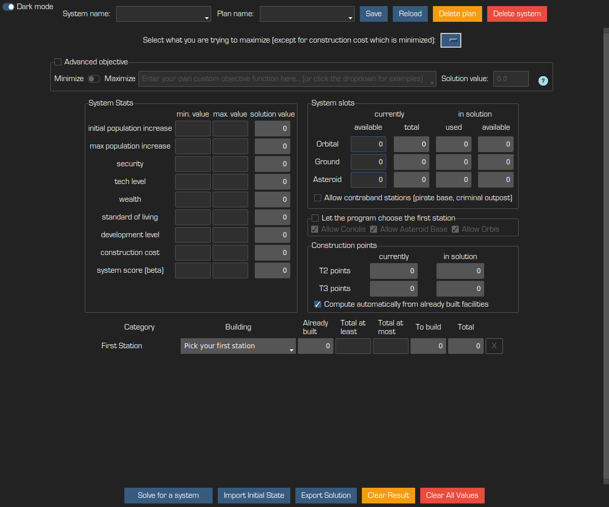
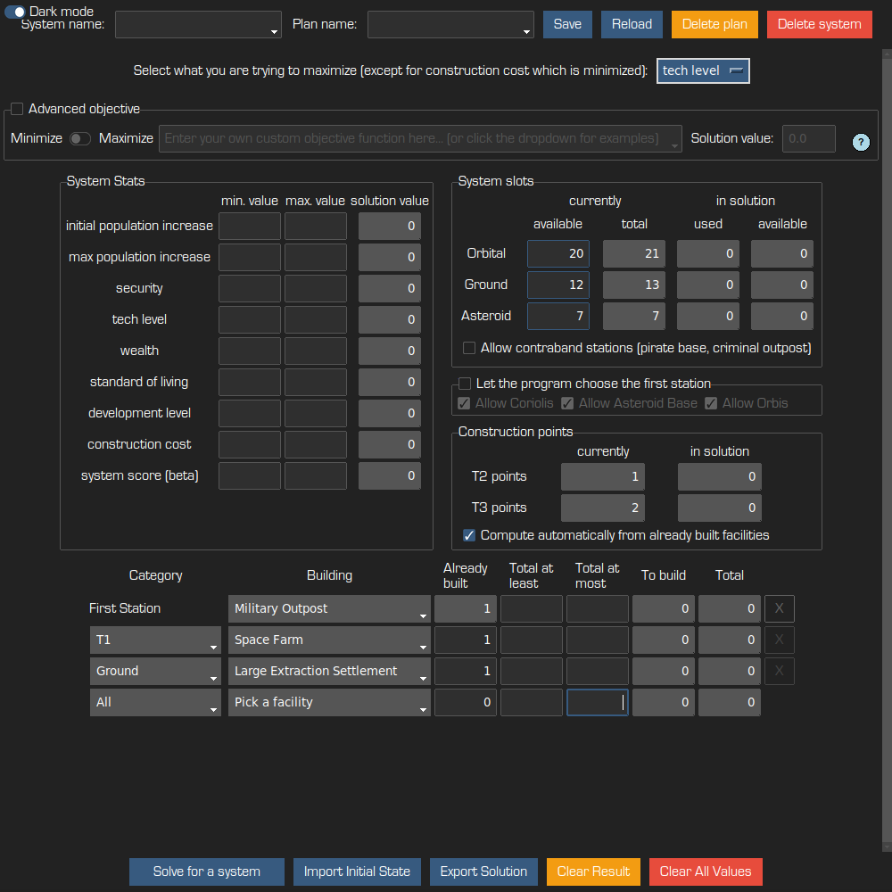
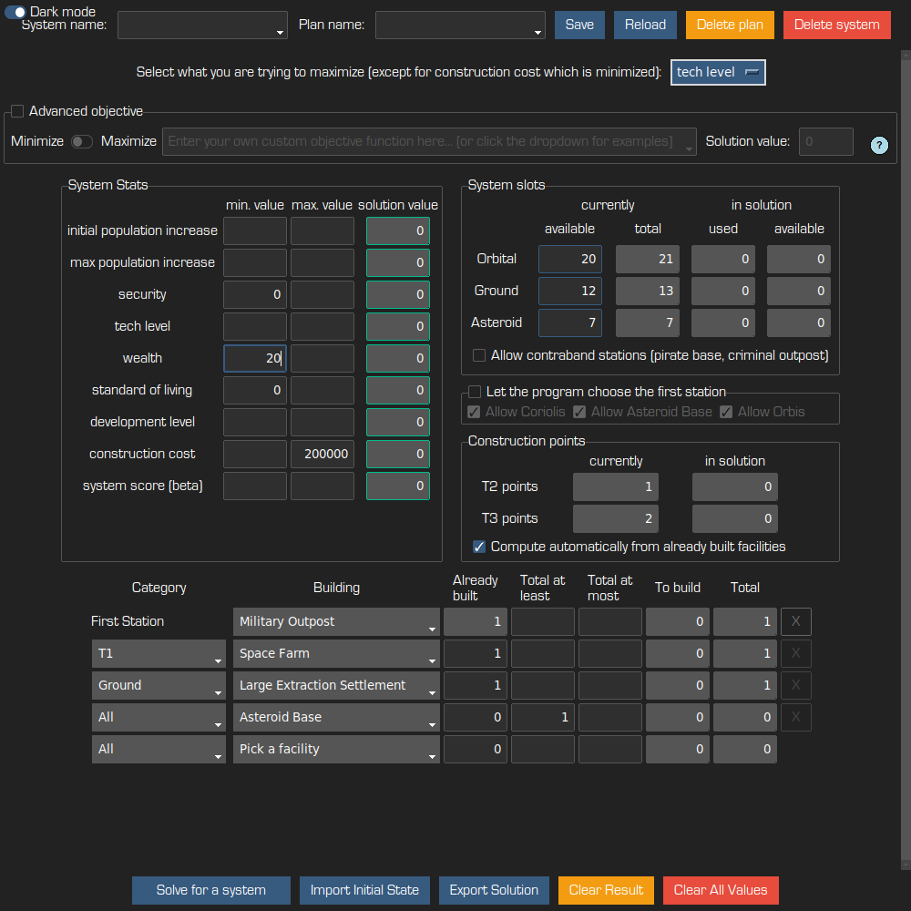

# EDCP: Elite Dangerous Colonisation Planner

## How to use

Just run the application, enter your system data and what you want from a system, and the appliction
will provide a list of facilities to build to best achieve this.

Example of questions this tool can help answer:
* I want to get the maximum development level in my system, with at least 10 security and 20
  standard of living, what should I build?
* I want the minimum amount of commodities I need to haul to reach 200 system score, what should I build?
* I want the highest possible wealth while hauling at most 50,000 tons of commodities, what
  is my best option?
* What to build if I want to balance between wealth and tech level?

The tool takes into account the construction points, the dependencies between facilities, the
increase in construction points requirements, and so much more.

## Tutorial

Here is a screenshot of the application when you start it. 

You should fill the number of available
slots of each type and provide an objective (maximize wealth, minimize construction cost, ...). If
you have already started building in the system select the first station and the other already
present buildings. Otherwise you can select "Let the program choose for me" and the app will pick
the best choice for your first station.

Optionally you can set minimum or maximum values in the "System stats" panel. You can also specify
minimum or maximum numbers for some facility types. 

Then you are ready to hit the "Solve for a system" button and let the solver provide you with a
solution.

If the solution is not to your liking, you can add constraints to force the solver into the right
direction (limit construction cost, limit how many communication stations you are willing to build,
...), and solve the system again.

Once you are happy with the solution, you can enter a system name and plan name at the top of the
window, and "Save". This will allow you to reload these same settings later. You can have several
plans for a system to try different directions.

## Import / Export

### Importing the already built facilities

If you have already started building and/or planning your system, and are using the great planning
tools developed by the community, you can import this initial state into EDCP with the "Import
initial state" button. For now EDCP supports two external tools:
* [Colonization Construction
  v3](https://forums.frontier.co.uk/threads/v3-of-the-colonization-construction-spreadsheet-is-now-available.635762/)
  by DaftMav: simply copy the contents of the column 'D' from any of your Colony tabs and paste it
  into EDCP's import text box.
* [Scuffed](https://cmdr-nowski.github.io/scuffed/) by CMDR Nowski: use the export link at the top
  right, and copy/paste the contents of the textbox

EDCP will automatically fill the list of already built facilities. You still have to specify the
number of available slots, and any other constraint you want to give to the solver.

If you are developing another tool for managing colonization, let us know and we will be happy to
add your tool to this list!

### Exporting the result

Once you have found a solution you like, you can export the result back into either of these tools,
by using the "Export Solution" button at the bottom. EDCP will provide a valid order for building
the chosen facilities, and you can copy the result in your desired format, either to the clipboard
or to a file.

## Feedback welcome!

We welcome any feedback, you are welcome to create issues here on Gitlab for bug reports, feature
requests, or any other comment you want to provide.

## Warning

Always double check that the facility list is actually buildable. We might have made a mistake. If
you see such a mistake, please take a screenshot and submit an issue!

Tip for Linux users: if you want to use the correct font, please copy the `eurostile.TTF` file into
the `${HOME}/.fonts/` directory.
